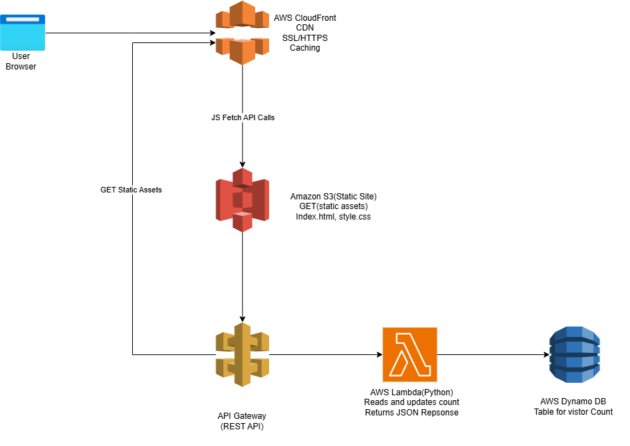

# 🌥️ Cloud Resume Challenge – Serverless Deployment on AWS

## 📁 Table of Contents

- [Overview](#overview)
- [Features](#features)
- [Architecture](#architecture)
- [AWS Services Used](#aws-services-used)
- [Folder Structure](#folder-structure)
- [Setup & Deployment](#setup--deployment)
- [Cleanup](#cleanup)
- [Screenshots](#screenshots)
- [Future Improvements](#future-improvements)
- [References](#references)
- [License](#license)

## 📖 Overview

This project is my implementation of the **Cloud Resume Challenge** (AWS Edition), a hands-on project designed to deepen cloud and DevOps skills. The goal was to build a **static resume website** with a **live visitor counter**, fully hosted on AWS using **serverless architecture** and **Infrastructure as Code (IaC)** with AWS SAM.

## 🚀 Features

✅ Static Resume hosted on S3  
✅ Visitor Counter with API Gateway, Lambda & DynamoDB  
✅ HTTPS with CloudFront  
✅ Serverless architecture via AWS SAM  
✅ Infrastructure as Code (IaC)  
✅ CI/CD with GitHub Actions  

## 🏗 Architecture



### Data Flow:

1. **User request** hits **CloudFront**, providing HTTPS and caching.
2. **Static website** (HTML/CSS) served from **Amazon S3**.
3. **JavaScript Fetch API** calls a REST endpoint on **API Gateway**.
4. **API Gateway** triggers a **Lambda function**.
5. **Lambda** reads/writes visitor count to **DynamoDB**.
6. Updated visitor count returned and displayed on the webpage.

## 🛠️ AWS Services Used

| Service      | Purpose                               |
| ------------ | ------------------------------------- |
| Amazon S3    | Static Website Hosting                 |
| CloudFront   | HTTPS + CDN Caching                    |
| API Gateway  | Expose RESTful API                     |
| AWS Lambda   | Serverless logic for visitor count     |
| DynamoDB     | Stores visitor data                    |
| AWS SAM      | Infrastructure as Code                 |
| IAM Roles    | Secure access between services         |

## 🗂 Folder Structure

```bash
📁 hello_world/         # Lambda function source
    └── app.py
index.html              # Static resume
style.css               # Styling
template.yaml           # SAM template
samconfig.toml          # SAM deploy config
README.md               # This file
```

## ⚙️ Setup & Deployment

### Prerequisites:

- AWS CLI configured
- AWS SAM CLI installed
- AWS account with necessary permissions

### Build the Lambda package:

```bash
sam build
```

### Deploy the stack (guided mode):

```bash
sam deploy --guided
```

### After deployment:

- Retrieve the **API Gateway URL** from the SAM output.
- Update your `index.html` JavaScript fetch call with this URL.

Example:

```javascript
fetch('https://your-api-id.execute-api.region.amazonaws.com/Prod/visitor')
```

## 🧼 Cleanup

To delete all deployed resources:

```bash
sam delete
```

